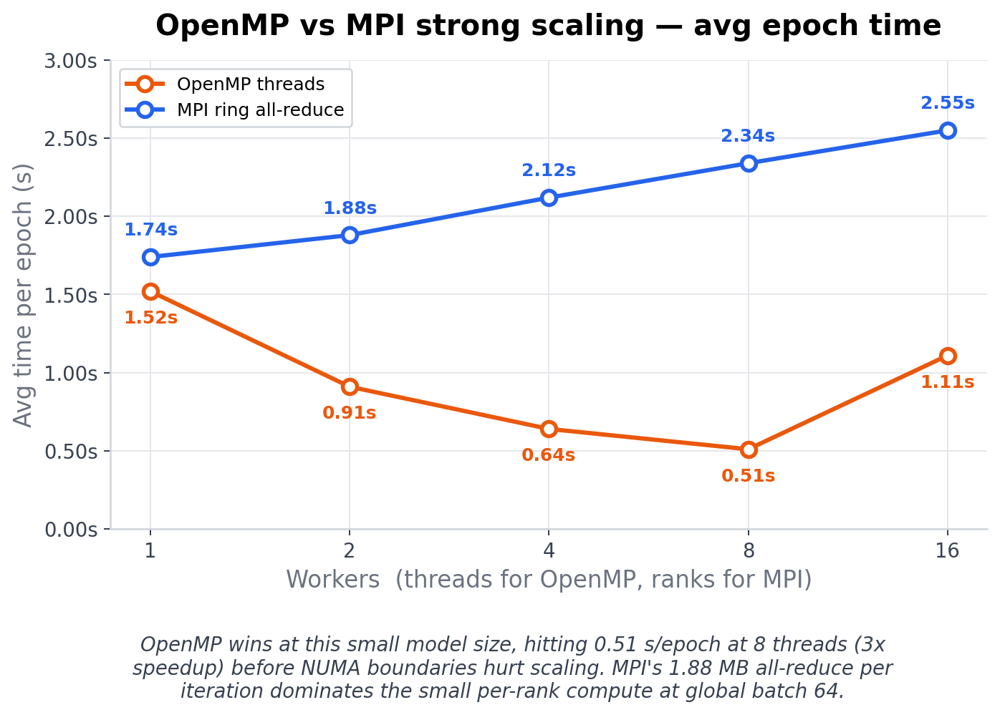
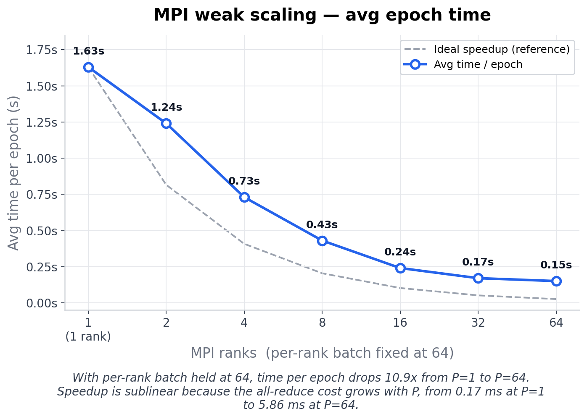
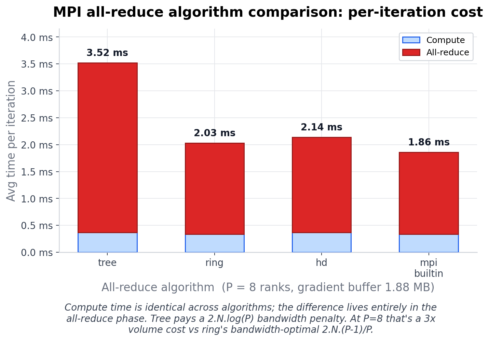

# Parallel Neural Network Training with MPI

A from-scratch C++ implementation of data-parallel stochastic gradient descent for feedforward neural networks, with three hand-rolled MPI all-reduce algorithms (tree, ring, halving-doubling) for gradient aggregation. Includes a sequential / OpenMP baseline for comparison.

The point of the project is to make the communication side of distributed training visible, and how the choice of all-reduce algorithm affects per-iteration cost and alpha-beta cost model maps onto real measurements on a modern HPC system.

Trained on MNIST (~235K parameters, ~1.88 MB gradient buffer); benchmarked on Perlmutter CPU nodes. Results are only benchmarked on a single node, multi node Slingshot tests are TODO.

## Results

### OpenMP vs MPI strong scaling
Same workload, varying worker count. OpenMP wins at this small model size because the per-rank compute is too small to amortize MPI's all-reduce cost; OpenMP scaling stops past 8 threads when threads cross NUMA boundaries. MPI should in theory overtake OpenMP when tested using multiple nodes (TODO for me to add results depicting this).



### MPI weak scaling
Per-rank batch held at 64, global batch grows with rank count — the configuration used in production distributed training (DDP, Horovod). 10.9× speedup from 1 to 64 ranks. Speedup is sublinear because per-iteration all-reduce cost grows with P (0.17 ms at P=1, 5.86 ms at P=64).



### All-reduce algorithm comparison
Per-iteration cost for all four algorithms at P=8 on the same training workload. Compute is identical across algorithms; the entire difference lives in the all-reduce phase. Tree pays a 2·N·log(P) bandwidth penalty. at P=8 that's a 3× volume cost vs. ring's bandwidth-optimal 2·N·(P−1)/P. Ring slightly loses to halving-doubling on my single node setup but I expect halving-doubling to outperform when benchmarked using multiple nodes because the latency gap widens and the NUMA-locality advantage that helps ring on a single node disappears once you're crossing the network.



## All-reduce algorithms

`include/allreduce.h` exposes four algorithms, all in-place sum reductions over `MPI_DOUBLE`:

| algorithm           | latency steps | bytes/rank          | best regime                      |
|---------------------|---------------|---------------------|----------------------------------|
| `tree`              | 2 log P       | 2 N log P           | small messages                   |
| `ring`              | 2 (P − 1)     | 2 N (P − 1)/P       | large messages, low-latency net  |
| `halving_doubling`  | 2 log P       | 2 N (P − 1)/P       | large messages, large P, power-of-2 |
| `mpi`               | (impl)        | (impl)              | reference baseline               |

`tree` is binomial reduce-to-root + binomial broadcast. `ring` is the standard chunk-by-chunk reduce-scatter / all-gather around a unidirectional ring. `halving_doubling` is Rabenseifner: recursive-halving reduce-scatter followed by recursive-doubling all-gather, falling back to `MPI_Allreduce` when P is not a power of two.

The algorithms operate on a private communicator (created with `MPI_Comm_dup`) so their point-to-point traffic is isolated from other MPI calls in the training loop. This matters: without it, an `MPI_Allreduce` for loss reporting elsewhere in the iteration can interfere with the hand-rolled algorithms' progress in subtle ways.

## Repository layout

```
include/
    nn.h                  network and optimizer interface
    allreduce.h           hand-rolled all-reduce algorithms
src/
    nn.cpp                feedforward net, forward / backward / pack / unpack
    main.cpp              sequential / OpenMP training driver
    allreduce.cpp         tree, ring, halving-doubling implementations
    main_mpi.cpp          data-parallel SGD with selectable all-reduce
    allreduce_bench.cpp   standalone correctness + microbench
scripts/
    strong_scaling.sh     fixed dataset, varying rank count
    compare_algos.sh      all four algorithms at fixed P
    microbench.sh         alpha-beta sweep across message sizes
docs/                     charts shown above
Makefile
download_mnist.py
```

## Dependencies

- C++17 compiler (`g++` on Linux, `clang++` on Mac)
- An MPI implementation with `mpicxx` on PATH (Open MPI, MPICH, Cray MPICH)
- Eigen 3.4

On Mac:

```bash
brew install open-mpi eigen
```

On Ubuntu / Debian:

```bash
sudo apt install libopenmpi-dev libeigen3-dev
```

Otherwise clone Eigen into the project root (the Makefile auto-detects it):

```bash
git clone --branch 3.4.0 --depth 1 https://gitlab.com/libeigen/eigen.git
```

## Build

```bash
python3 download_mnist.py        # pulls MNIST into data/
make all                         # builds train, train_mpi, allreduce_bench
make seq                         # just the sequential / OpenMP target
make mpi                         # just the MPI target
make bench                       # just the all-reduce microbench
```

To disable OpenMP within MPI ranks (pure MPI):

```bash
make OMP=0 mpi
```

## Run

```bash
# Sequential / OpenMP
OMP_NUM_THREADS=8 OMP_PLACES=cores OMP_PROC_BIND=close ./build/train

# Data-parallel SGD
mpirun -np 4 ./build/train_mpi --algo ring --epochs 10 --global-batch 64

# Standalone all-reduce microbenchmark
mpirun -np 8 ./build/allreduce_bench --sizes 1024,65536,1048576
```

## `train_mpi` flags

```
--algo <tree|ring|hd|mpi>      all-reduce algorithm (default: ring)
--epochs <int>                 number of epochs (default: 10)
--global-batch <int>           total batch size across ranks (default: 64)
--lr <float>                   learning rate (default: 0.01)
--momentum <float>             SGD momentum (default: 0.9)
--nonblocking                  pipeline per-layer iallreduce with backward
--verify                       per-iter verify hand-rolled all-reduce vs MPI_Allreduce
--warmup <int>                 skip first N iterations in timing (default: 0)
--train <path>                 train CSV (default: data/mnist_train.csv)
--test  <path>                 test  CSV (default: data/mnist_test.csv)
```

`train_mpi` shards the global batch across ranks: with `--global-batch 64` and `-np 4`, each rank processes 16 samples per step. After backward, gradients are summed across ranks via the chosen algorithm and divided by world_size, so the parameter update is mathematically identical to single-rank training on the full batch.

`--nonblocking` swaps in a custom backward (`backward_pipelined` in `main_mpi.cpp`) that fires `MPI_Iallreduce` on layer L's gradients as soon as they're computed, then walks down to layer L−1. All requests are awaited just before the optimizer step. This overlaps the all-reduce of later layers with the gradient computation of earlier ones.

`--verify` recomputes each iteration's all-reduce with `MPI_Allreduce` on a copy and aborts if the results differ. Slow; use it once after any change to the algorithms.

At the end of a run, `train_mpi` prints a per-iteration breakdown:

```
--- timing summary (95 iters, warmup 5 skipped) ---
avg compute / iter:    16.479 ms
avg all-reduce/iter:   46.059 ms  (70.2% of iter)
avg total / iter:      65.649 ms
gradient buffer:      235146 doubles (1.88 MB)
```

## Benchmarking scripts

All scripts emit a CSV alongside their console output.

```bash
# Strong scaling for one algorithm
ALGO=ring RANKS="1 2 4 8" EPOCHS=3 ./scripts/strong_scaling.sh
#   -> scaling_ring.csv  (ranks, epoch, loss, acc, time_s, samples_per_s)

# All four algorithms at fixed P, plus the non-blocking pipelined variant
P=8 EPOCHS=2 ./scripts/compare_algos.sh
#   -> compare_p8.csv    (algo, nonblocking, compute_ms, allreduce_ms, iter_ms, allreduce_pct)

# Alpha-beta sweep across message sizes
P=8 SIZES=1024,8192,65536,524288,4194304 REPS=30 ./scripts/microbench.sh
#   -> microbench_p8.csv (ranks, size, algo, median_ms, min_ms, gbs_eff)
```

## Using the all-reduce primitives elsewhere

The `allreduce::` API is a drop-in replacement for `MPI_Allreduce` on a flat buffer:

```cpp
#include "allreduce.h"

MPI_Comm reduce_comm = allreduce::dup_comm(MPI_COMM_WORLD);

// During training:
net.backward(X_batch, Y_batch);
Eigen::VectorXd flat = net.pack_gradients();
allreduce::run(allreduce::Algorithm::RING, flat.data(), flat.size(), reduce_comm);
flat /= world_size;
net.unpack_gradients(flat);
optimizer.update(net, epoch);

// Before MPI_Finalize:
MPI_Comm_free(&reduce_comm);
```

To broadcast weights from rank 0 at startup so all ranks start from the same parameters:

```cpp
Eigen::VectorXd params = net.pack_params();
MPI_Bcast(params.data(), params.size(), MPI_DOUBLE, 0, MPI_COMM_WORLD);
net.unpack_params(params);
```

## Running on Perlmutter

```bash
module load PrgEnv-gnu cray-mpich
git clone --branch 3.4.0 --depth 1 https://gitlab.com/libeigen/eigen.git
make all CXX=CC MPICXX=CC

salloc -N 1 -C cpu -q interactive -t 01:00:00 -A <account>
srun -n 8 -c 32 --cpu-bind=cores ./build/train_mpi \
    --algo ring --epochs 10 --global-batch 64
```

For hybrid MPI+OpenMP runs, `OMP_NUM_THREADS` controls the thread count per rank; pin ranks with `srun --cpu-bind=cores`.

## Acknowledgements

The sequential network implementation is adapted from [Distributed-Neural-Net](https://github.com/ekloberdanz/Distributed-Neural-Net) (E. Kloberdanz). Algorithm cost models follow Thakur, Rabenseifner & Gropp, *"Optimization of Collective Communication Operations in MPICH"* (2005).
